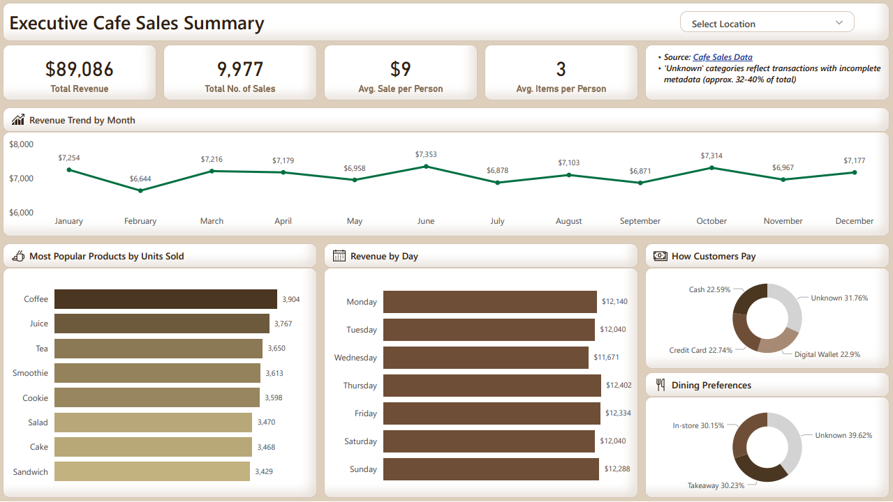

# Cafe Sales Analysis

## Project Overview
This project demonstrates a full data analytics workflow, taking a "dirty" dataset of cafe transactions and transforming it into a high-level executive dashboard. 

## Tools Used
* **Data Cleaning:** Python (Pandas, NumPy)
* **Visualization:** Power BI
* **Documentation:** Jupyter Notebook

## The Data Cleaning Phase
* **Handling Missing Values:** Addressed nulls in `Item` and `Quantity` columns to prevent revenue underreporting.
* **Data Type Standardization:** Converted `Transaction Date` to datetime objects for time-series analysis.
* **Anomaly Detection:** Verified `Total Spent` calculations against `Quantity * Price Per Unit` to ensure data integrity.

## Key Insights from the Dashboard
* **Revenue Drivers:** Total revenue reached **$89,086**, with **Coffee** being the most popular product (3,904 units sold).
* **Monthly Performance:** Sales (from $6,644 to $7,353) have been **consistent throughout the year** with minimal fluctuations recorded. 
* **Customer Trends:** Customers **do not show any specific preferences** on how they pay and where they prefer to eat.

## Files
* `Data_Cleaning_of_Cafe_Sales_Data.ipynb`: The Python script used for data cleaning.
* `Cafe_Sales_Dashboard.png`: The final dashboard used for analysis.
